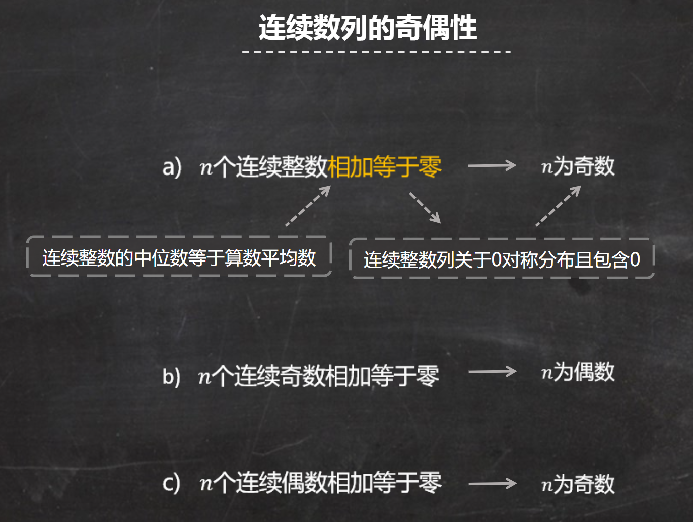

# 1.1.整数性质

## 奇偶性

在考场上直接使用特殊值法即可。

## 约数和倍数

求解步骤：

**PS. 要找寻最小公倍数，要把所有不同质因数中每个质因数指数最大的那个数字提出来相乘。（图片的方法并不是非常清晰）**

## 连续整数

一般性质

奇偶性

## 因子

例子：
**写成质数因子相乘的情况**
下列那一个是 $1.2 \cdot 10^{10}$的因子？

## 错题

If M is the least common multiple of 90, 196, and 300, which of the following is NOT a factor of M?
分解因数：$90=2\times {{3}^{2}}\times 5$，$196={{2}^{2}}\times {{7}^{2}}$，$300={{2}^{2}}\times 3\times {{5}^{2}}$

所以三个数的最小公倍数是${{2}^{2}}\times {{3}^{2}}\times {{5}^{2}}\times {{7}^{2}}$

A $600={{2}^{3}}\times 3\times {{5}^{2}}$，不是${{2}^{2}}\times {{3}^{2}}\times {{5}^{2}}\times {{7}^{2}}$的约数

B $700={{2}^{2}}\times {{5}^{2}}\times 7$，是${{2}^{2}}\times {{3}^{2}}\times {{5}^{2}}\times {{7}^{2}}$的约数

C $2100={{2}^{2}}\times 3\times {{5}^{2}}\times 7$，是${{2}^{2}}\times {{3}^{2}}\times {{5}^{2}}\times {{7}^{2}}$的约数

D $4900={{2}^{2}}\times {{5}^{2}}\times {{7}^{2}}$，是${{2}^{2}}\times {{3}^{2}}\times {{5}^{2}}\times {{7}^{2}}$的约数

E $5400={{2}^{3}}\times {{3}^{3}}\times {{5}^{2}}$，不是${{2}^{2}}\times {{3}^{2}}\times {{5}^{2}}\times {{7}^{2}}$的约数

因此正确答案是AE