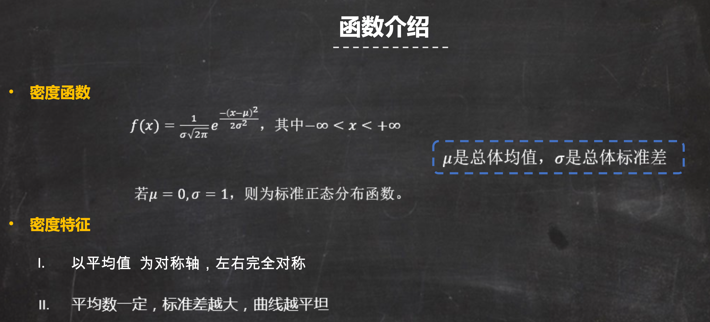
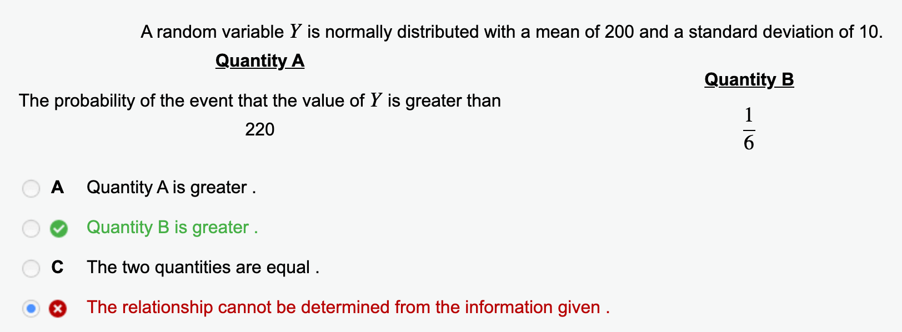
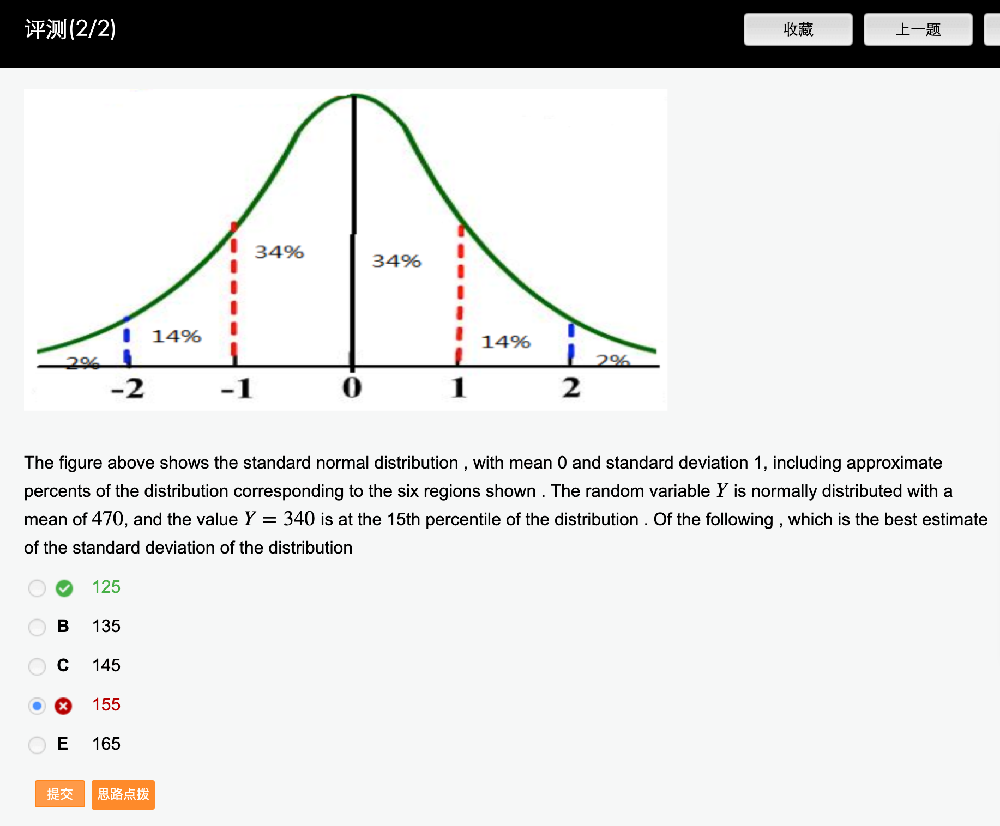

# 4.3正态分布
## 基本概念

## Ex

**$标准差=\bar X\pm\ro$**

## 错题
### 测评1:

Y 服从均值为200，标准差为10的正态分布
则220处于2σ位置处
按照正态分布面积规律，小于2σ的概率为95 % 
 从而Y大于220的概率为5%×12=140
Quantity A得到的值为140
 Quantity B得到的值为16
 从而Quantity A小于Quantity B
### 测评2

对于Y，其均值为470，设其标准差为σ，则$Y−470σ∼N(0,1)$
 
Y=340时，处于15%的位置，从而$\frac{340−470}{σ}<−1$
 得到σ<130  
 从而对标准差最好的近似为A选项
## 做题Tip
- 正态分布的概率要记
- Precentile: 统计学术语，如果将一组数据从小到大排序，并计算相应的累计百分位，则某一百分位所对应数据的值就称为这一百分位的百分位数。可表示为：一组n个观测值按数值大小排列。如，处于p%位置的值称第p百分位数。