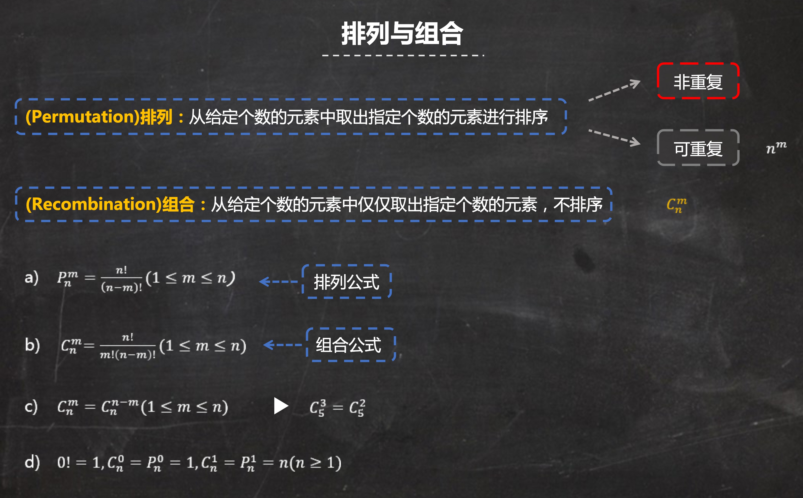
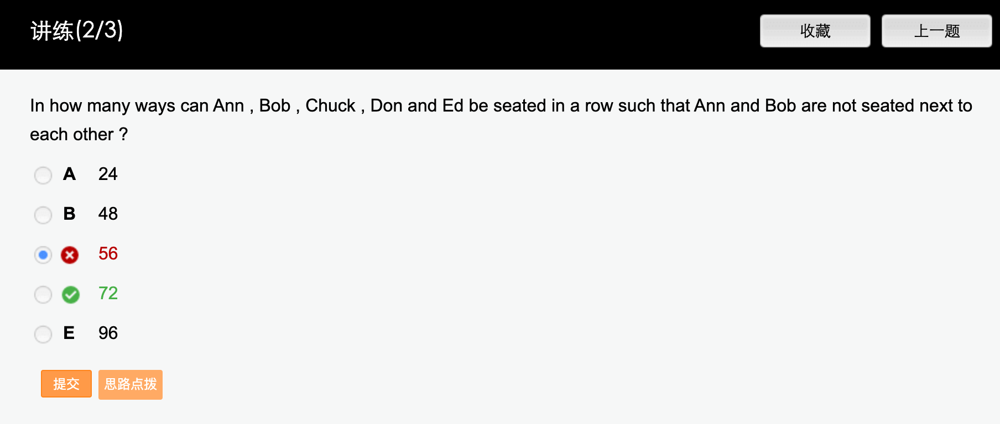
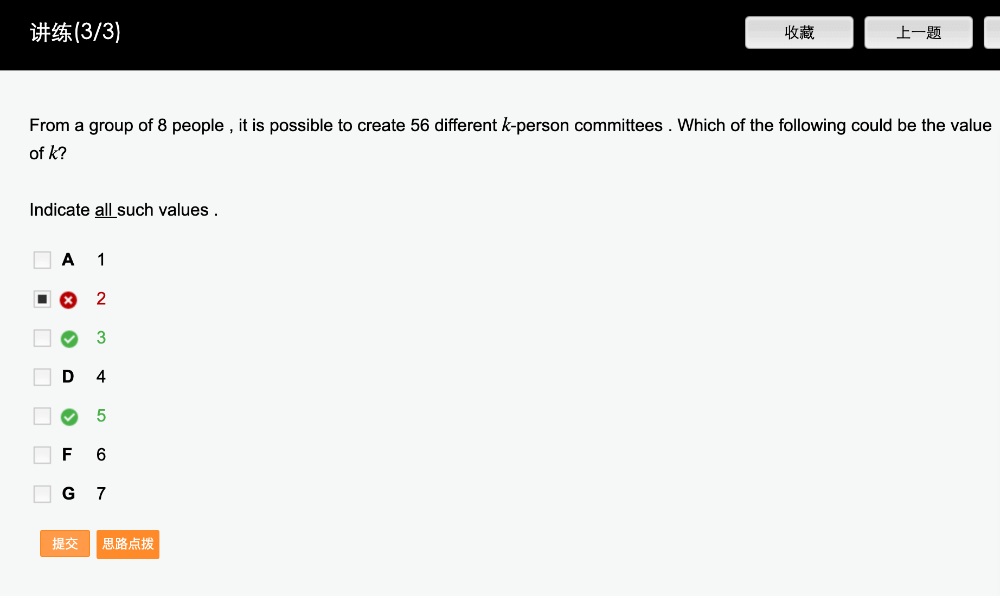
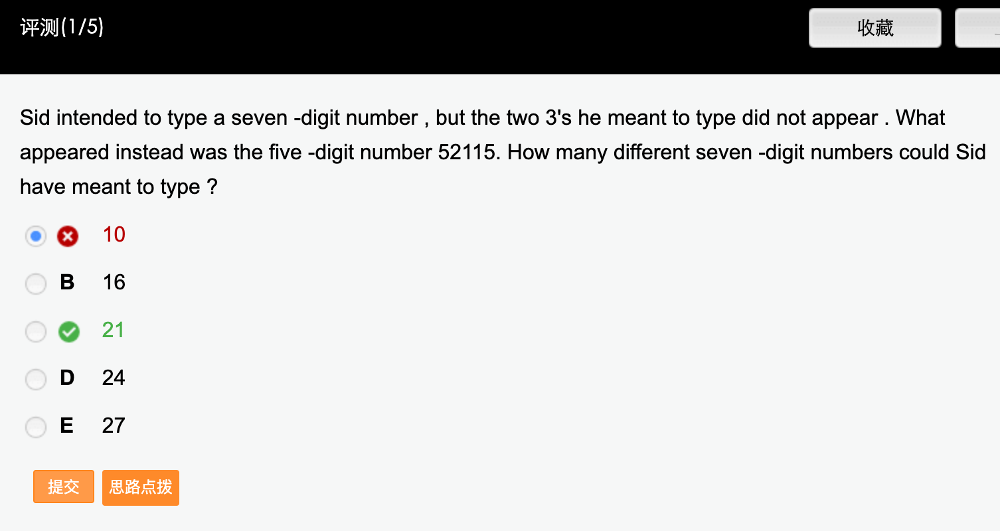
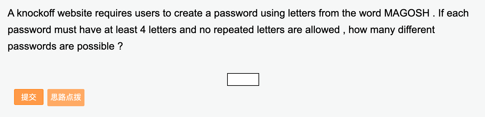
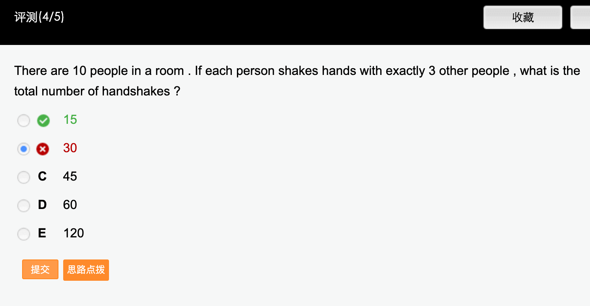

# 4.4排列组合与概率
## ！排列组合

### Ex

## 概率

### Ex

## 错题
讲练2:

共有5个人，要使得Ann, Bob不相邻，需要将剩下的三个人全排列，可生成4个空
将 Ann, Bob选择两个空插入并排列

从而，共有$A^3_3×A^2_4=72$种情况

讲练3:

题设条件给出，从8个人中随机选择k个人，有56种不同的情况，即：
$C^k_8=56$
 因为$C^3_8=C^5_8=56$
所以k的可能取值为3或5

### 测评1

将2个3插入到52115这5个数里面，需要考虑两种情况：
 
(1) 两个3紧挨在一起，利用捆绑法，插入到6个空中，有6种情况
 
(2)两个3分开插入到6个空中，相当于从6个空中选择两个空，共有C26=15种情况
 
利用加法原理，共有6+15=21种情况

### 测评2

MAGOSH共有6个字母

 

假若密码有4个字母，则有A46=360
 

假若密码有5个字母，则有A56=720
 

假若密码有6个字母，则有A66=720
 

按照加法原理，共有360+720+720=1800

**注意排列与组合之间的差别**

### 测评4

握手问题
先不考虑重复，每个人都与3个人握手共握手10×3=30次

但是握手这一行为是相互的

因此30要除以2，实际需要握手的次数为302=15次