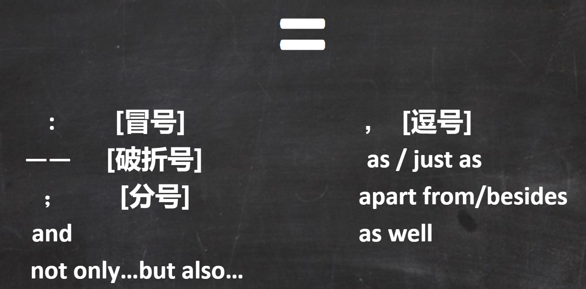
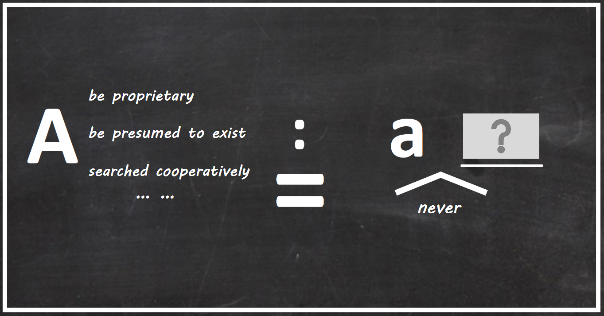
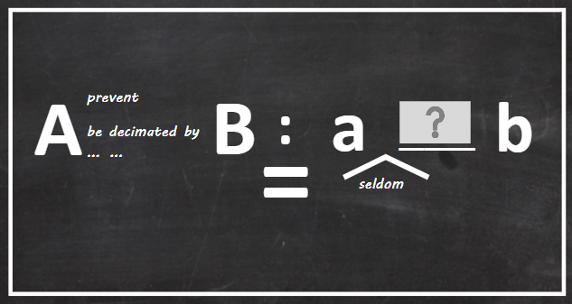
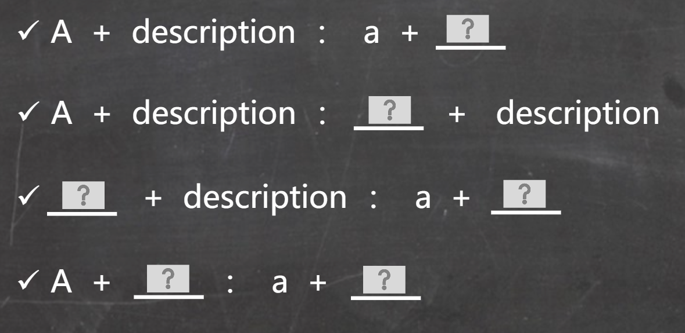
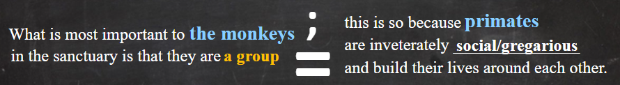

# 并列关系

## 并列关系 I

线索词

本质——单对象：

本质——多对象：

**注意其中我们可能使用seldom和never来进行取反**

## Recap, 步骤
- Step1：关注线索词
    - 同义重复（但是要注意and之后没有although和**paradoxically**表示取反的词）
    - 经常出现在中间部分，容易在and前后挖空，同时在空前后给线索词
- Step2：从已知推未知
    - 
    - 可能会取非挖空

## 习题

！
1. 重点关注挖空所属的重复关系
2. 补全省略部分
3. 描述对象不认识时更需关注描述与特征